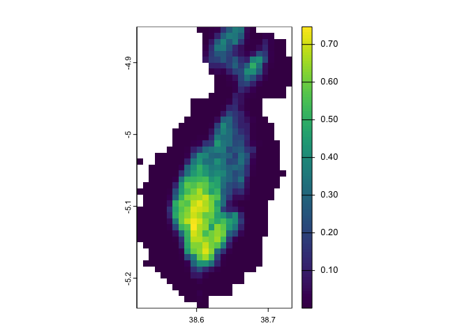
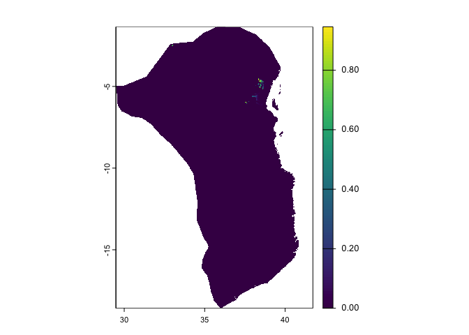
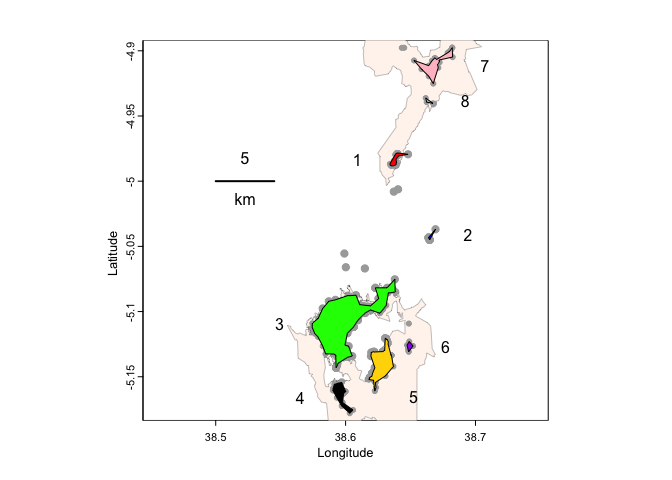
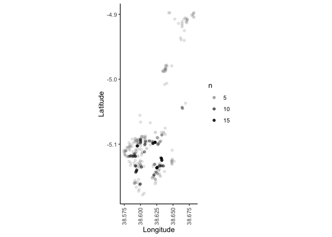
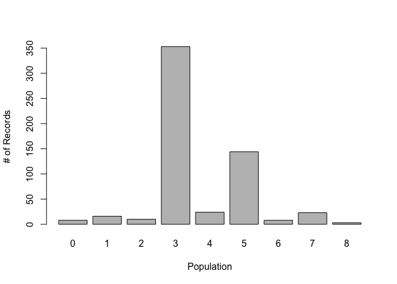
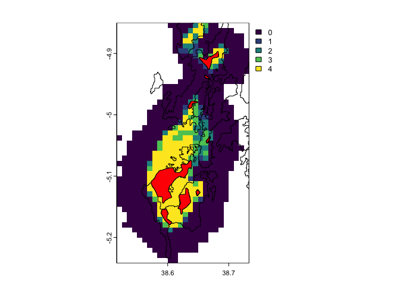
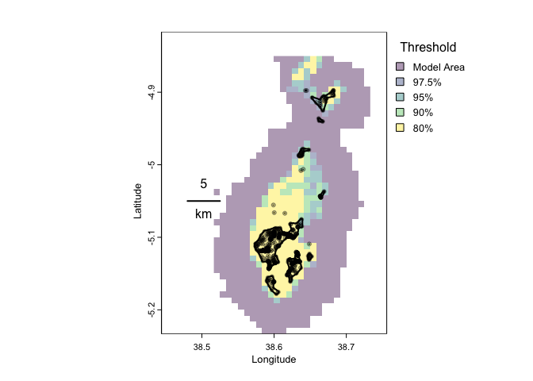
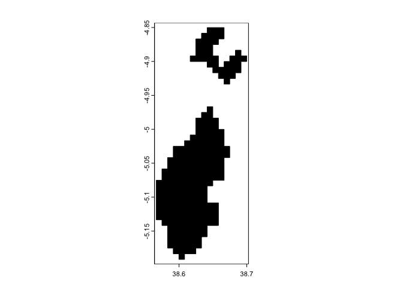

Appendix 1: *Artisornis moreaui* Distribution Modelling
================
Jacob C. Cooper et al.

true

# Introduction

This pipeline performs distribution analyses for *Artisornis moreaui*,
an endemic species found only in the East Usambara, Tanzania. (Note:
This manuscript excludes *A. sousae*, sometimes considered conspecific,
and endemic to northern Mozambique).

Specifically, we import survey data from the region to create concave
hulls around points to understand the populations’ distributions, and
then compare these concave hulls to ecological niche models and to
Protected Areas and forest cover layers from the mountain range to
compare their size estimations. We are specifically trying to determine
how much of the species distributions are encompassed in these other
data layers, and what is best for estimating the distribution to protect
the species.

Required packages will be noted throughout different sections of the
document.

## Required Programs

In addition to *R*, this pipeline relied upon `MAXENT` to create
ecological niche models.

# *Artisornis* Occurrence Data

Here, we are reformatting survey data for analyses.

``` r
library(data.table)
library(readxl)
library(terra)
library(tidyverse)
```

# Data

Our data comes from intensive local surveys for *Artisornis moreaui*
within the East Usambara.

## Survey Data

We want to reformat the survey data to be more readable for our programs
and analyses.

``` r
# load survey data
# read from Excel, reformat for our analyses
arti_all <- read_excel(paste0(filepath,
                               "LBT_Sightings (Ver 20Dec22).xlsx"),
                        sheet="All_Tailorbirds")

# keep relevant columns
# remove rows without data
arti_surveys <- arti_all %>%
  select(Date,No_of_inds,
         UTM_North,UTM_East) %>%
  na.omit()
```

These data are currently in UTMs, but we can convert these to decimal
degrees so it is easier for us to use them with other data layers. Our
points are in UTM Zone 37.

``` r
# Import UTMs to vector shapefile
utms <- cbind(arti_surveys$UTM_East,
              arti_surveys$UTM_North)%>%
  vect(type="points",crs="+proj=utm +zone=37 +south=T +east=T +datum=WGS84 +units=m")
```

    ## Warning in p@ptr$setPointsXY(as.double(x[, 1]), as.double(x[, 2])): NAs
    ## introduced by coercion
    ## Warning in p@ptr$setPointsXY(as.double(x[, 1]), as.double(x[, 2])): NAs
    ## introduced by coercion

``` r
# Convert UTMs
dds <- project(utms,"+proj=longlat +datum=WGS84")
```

We can visualize these coordinates to see how the conversion progressed.

``` r
# extract coords

coords <- dds %>% geom() %>% as.data.frame()

plot(x=coords$x,y=coords$y,pch=19,asp=1)
```

<!-- -->

We can now create a new dataframe with our converted coordinates
attached.

``` r
coords <- coords %>%
  rename(Longitude = x, Latitude = y) %>%
  select(Longitude,Latitude)

converted_data <- arti_surveys %>% cbind(coords) %>% na.omit() %>% unique()

# getting unique to represent unique localities with occurrences

# save as a backup

write_csv(converted_data,paste0(filepath,"converted_coords.csv"))
```

``` r
summary(converted_data)
```

    ##       Date                          No_of_inds     UTM_North      
    ##  Min.   :2006-01-14 00:00:00.00   Min.   :1.00   Min.   :9427654  
    ##  1st Qu.:2008-05-08 00:00:00.00   1st Qu.:1.00   1st Qu.:9432568  
    ##  Median :2010-09-06 00:00:00.00   Median :2.00   Median :9434292  
    ##  Mean   :2011-05-14 19:57:57.75   Mean   :1.57   Mean   :9435884  
    ##  3rd Qu.:2014-09-19 00:00:00.00   3rd Qu.:2.00   3rd Qu.:9436599  
    ##  Max.   :2017-07-12 00:00:00.00   Max.   :4.00   Max.   :9458649  
    ##     UTM_East        Longitude        Latitude     
    ##  Min.   :452813   Min.   :38.57   Min.   :-5.178  
    ##  1st Qu.:455025   1st Qu.:38.59   1st Qu.:-5.133  
    ##  Median :456713   Median :38.61   Median :-5.118  
    ##  Mean   :457194   Mean   :38.61   Mean   :-5.103  
    ##  3rd Qu.:458929   3rd Qu.:38.63   3rd Qu.:-5.097  
    ##  Max.   :464790   Max.   :38.68   Max.   :-4.898

Our dataset contains 589 points.

We can now move into the `KUENM` pipeline, which includes creating a
training area in `grinnell`.

This will create another `rmarkdown` file for us to use.

``` r
# extension not needed
kuenm_start(paste0(filepath,"artisornis_kuenm"))
```

# Dispersal Area Estimation

Using the package `Grinnell`, we can develop a dispersal area estimation
for these taxa. This is based on code by Jacob C. Cooper and Joshua G.
Bell (Haskell Indian Nations University).

``` r
# install GRINELL

if (!require("remotes")) {
  install.packages("remotes")
}

remotes::install_github("fmachados/grinnell")
# requires ellipsenm
devtools::install_github("marlonecobos/ellipsenm")
```

``` r
library(grinnell)
library(ellipsenm)
```

Create a directory to save Grinnell results.

``` r
temp <- paste0(filepath,"grinnell")
dir.create(temp)
```

Utilizes the occurrence file that we already have. *Note* that these are
often rarefied, but we are not rarefying our file based on the
extensiveness of the surveys.

``` r
occ <- read_csv(paste0(filepath, "converted_coords.csv"))
```

    ## Rows: 589 Columns: 6
    ## ── Column specification ────────────────────────────────────────────────────────
    ## Delimiter: ","
    ## dbl  (5): No_of_inds, UTM_North, UTM_East, Longitude, Latitude
    ## dttm (1): Date
    ## 
    ## ℹ Use `spec()` to retrieve the full column specification for this data.
    ## ℹ Specify the column types or set `show_col_types = FALSE` to quiet this message.

``` r
occ$SCIENTIFIC.NAME <- "Artisornis moreaui"

# reduce to long lats

occ=occ%>%
  rename(LONGITUDE = Longitude, LATITUDE = Latitude) %>%
  select(SCIENTIFIC.NAME,LONGITUDE,LATITUDE)
```

``` r
# load climatic layers

files <- list.files(paste0(filepath,"chelsa_data/"),pattern="*.tif")
files <- paste0(filepath,"chelsa_data/",files)
variables <- raster::stack(files)
```

Resize for this part. We are reducing this to the area for the nominate
subspecies, as this is the only one currently being studied.

``` r
shp <- terra::vect(paste0(filepath,"artisornis_small.shp"))
savepath <- paste0(filepath,"resampled/Set1")

for(i in 1:length(files)){
  # reduce to smaller geographic area
  fname <- files[i]
  temp <- crop(terra::rast(paste0(fname)),shp)
  temp <- mask(temp,land)
  
  temp <- subst(temp,NA,-9999)
  
  #x2=x
  #res(x2)=10*res(x)[1]
  #x2 <- resample(x,x2)
  dir.create(savepath,showWarnings = F)
  s.name <- strsplit(files[i],"/")[[1]][6]
  s.name <- gsub(".tif",".asc",s.name)
  #s.name <- gsub("_","",s.name)
  #s.name <- gsub("V.2.1","",s.name)
  writeRaster(temp,filename = paste0(savepath,"/",s.name),
              filetype="AAIGrid",overwrite=T,NAflag=-9999)
}
```

``` r
files <- list.files(paste0(filepath,"resampled/"),pattern="*.tif")
files <- paste0(filepath,"resampled/",files)
variables <- raster::stack(files)
```

The simulation results will be stored in the following subdirectory:

``` r
temp <- paste0(filepath,"grinnell")

odir1 <- file.path(temp, "eg_Msim1")
odir2 <- file.path(temp, "eg_Msim2")
odir3 <- file.path(temp, "eg_Msim3")
```

simulation in current climate

``` r
# load JCC fixes
source(paste0(filepath,"short_helpers.r"))
source(paste0(filepath,"pca_raster_jc.R"))

dispersal_simulationR <- grinnell::dispersal_simulationR
```

``` r
# conservative scenario

m <- M_simulationR_jc(data = occ, simulation_variables = variables,
                      max_dispersers = 4, replicates = 20, 
                      dispersal_events = 20,
                      output_directory = odir1)

# liberal scenario

m <- M_simulationR_jc(data = occ, simulation_variables = variables,
                      max_dispersers = 10, 
                      replicates = 20, 
                      dispersal_events = 50,
                      output_directory = odir2)

# another scenario; conservative
m <- M_simulationR_jc(data = occ, 
                      simulation_variables = variables,
                      max_dispersers = 4, # four dispersers per cell
                      replicates = 100, # 100 replicates
                      dispersal_events = 20, # more dispersal
                      output_directory = odir3,
                      kernel_spread = 2, # not very mobile
                      scenario_span = 1) 
```

**Simulation 3 gives us results that make the most sense.**

We are going to create another set of layers fitting to this accessible
area.

``` r
files <- list.files(paste0(filepath,"resampled/"),pattern="*.tif")
files <- paste0(filepath,"resampled/",files)

shp <- terra::vect(paste0(filepath,"grinnell/eg_Msim3/accessible_area_M.shp"))
savepath <- paste0(filepath,"resampled/Set2")

for(i in 1:length(files)){
  # reduce to smaller geographic area
  fname <- files[i]
  temp <- crop(terra::rast(paste0(fname)),shp)
  if(i == 1){
    crs(shp) <- crs(temp)
  }
  temp <- mask(temp,shp)
  
  temp <- subst(temp,NA,-9999)
  
  #x2=x
  #res(x2)=10*res(x)[1]
  #x2 <- resample(x,x2)
  dir.create(savepath,showWarnings = F)
  s.name <- strsplit(files[i],"/")[[1]][6]
  s.name <- gsub(".tif",".asc",s.name)
  #s.name <- gsub("_","",s.name)
  #s.name <- gsub("V.2.1","",s.name)
  writeRaster(temp,filename = paste0(savepath,"/",s.name),
              filetype="AAIGrid",overwrite=T,NAflag=-9999)
}
```

## Crop Data Layers

Crop the *M* layers to the `grinnell` area.

``` r
filepath <- "~/Dropbox/Manuscripts/Artisornis/"

var_files <- list.files(paste0(filepath,"chelsa_data/"),pattern='*.tif')

m1 <- vect(paste0(filepath,"artisornis_region.shp"))
m2 <- vect(paste0(filepath,"grinnell/eg_Msim3/accessible_area_M.shp"))

x <- rast(paste0(filepath,"resampled/",var_files[1]))
y <- rast(paste0(filepath,"resampled/",var_files[2]))

for(i in 1:length(var_files)){
  name <- strsplit(var_files[i],"_")[[1]][2]
  if(var_files[i]%like%"max"){
    name <- paste0(name,"_max")
  }
  if(var_files[i]%like%"min"){
    name <- paste0(name,"_min")
  }
  x <- rast(paste0(filepath,"chelsa_data/",var_files[i]))
  x <- x %>% crop(m1,mask=T)
  writeRaster(x,paste0(filepath,"kuenm_working/m_vars/Set1/",name,".asc"),
              overwrite=T,NAflag=-9999)
  x2 <- x %>% crop(m2,mask=T)
  writeRaster(x2,paste0(filepath,"kuenm_working/m_vars/Set2/",name,".asc"),
              overwrite=T,NAflag=-9999)
}
```

# Niche Modelling

*Please note I leave a lot of information here from the original
document by Cobos et al. Please see the package page to learn more.*

``` r
library(kuenm)
library(curl)
```

    ## Using libcurl 8.6.0 with LibreSSL/3.3.6

    ## 
    ## Attaching package: 'curl'

    ## The following object is masked from 'package:readr':
    ## 
    ##     parse_date

``` r
library(rnaturalearth)
# install rnaturalearthhires as well
library(terra)
library(tidyverse)
```

## Download and clip environmental layers

First, we need to download environmental layers for these species.
Because these layers are so large, we are going to be cropping them to a
general East African region immediately.

All data are between 2006 and 2017.

``` r
shp <- vect("~/Dropbox/Manuscripts/Artisornis/east_africa.shp")

# system to run bash
# remove white space at end of URL

files <- trimws(read_lines(paste0(filepath,"envidatS3paths.txt")))

for(i in 1:length(files)){
  print(paste("Starting",i))
  fname <- strsplit(files[i],"/")[[1]][11]
  
  # define savepath for saving files
  # wget from here not working right...
  curl_download(files[i],paste0(savepath,fname))
  # crop file
  temp <- crop(terra::rast(paste0(savepath,fname)),shp)
  temp <- mask(temp,land)
  # if you want to change extension
  # fname <- gsub(".tif",".asc",fname)
  terra::writeRaster(temp,paste0(savepath,fname),overwrite=T)
}
```

## KU ENM model creation

Candidate models are a large set of candidate models created to respond
to the need to test broad suites of parameter combinations, such as,
distinct regularization multiplier values, various feature classes, and
different sets of environmental variables. The following code calls the
help page of the function kuenm_cal.

``` r
help(kuenm_cal)
```

``` r
# load and prepare occurrence files
# will be different each time it is run
occ_joint <- read_csv(paste0(filepath,"converted_coords.csv")) %>%
  na.omit(occ_joint)
# 80 / 20 split of points
set.seed(815)
n <- round(0.8*nrow(occ_joint))
nrows <- sample(1:nrow(occ_joint),n,replace=F)

occ_tra <- occ_joint[nrows,]

write_csv(occ_tra,paste0(filepath,"occ_tra.csv"))
```

``` r
# read in and reformat saved files
# set up for KUENM

occ_joint <- read_csv(paste0(filepath,"converted_coords.csv"))
occ_tra <- read_csv(paste0(filepath,"occ_tra.csv"))

occ_tra$ScientificName <- occ_joint$ScientificName <- "Artisornis_moreaui"

occ_joint <- occ_joint%>%
  select(ScientificName,Longitude,Latitude)

occ_tra <- occ_tra%>%
  select(ScientificName,Longitude,Latitude)

occ_test <- occ_joint %>%
  setdiff(occ_tra)

write_csv(occ_joint,paste0(filepath,"occ_joint.csv"))
write_csv(occ_tra,paste0(filepath,"occ_tra.csv"))
write_csv(occ_test,paste0(filepath,"occ_test.csv"))
```

**Note** that this requires MAXENT: Steven J. Phillips, Miroslav Dudík,
Robert E. Schapire. \[Internet\] Maxent software for modeling species
niches and distributions (Version 3.4.1). Available from url:
<http://biodiversityinformatics.amnh.org/open_source/maxent/>. Accessed
on 2023-7-11.

``` r
M_var_dir <- "resampled"
batch_cal <- "Candidate_models"
out_dir <- "Candidate_Models_Marlon"
reg_mult <- c(seq(0.1, 1, 0.1), 2:5)
f_clas <- "all"
args <- NULL
maxent_path <- paste0(basepath,"maxent")
wait <- FALSE
run <- TRUE
```

``` r
occ_tra <- read_csv(paste0(filepath,"occ_tra.csv"))
temp <- rast("/home/jccooper/Dropbox/Manuscripts/Artisornis/resampled/Set1/CHELSA_bio10_1981-2010_V.2.1.asc")

plot(temp)
points(occ_tra[,2:3],pch=19)
```

The following is the code for using the function.

``` r
# load corrected script
source(paste0(filepath,"cooper_kuenm.R"))
```

``` r
setwd(filepath)

# note that previous steps ensure split done correctly
# note that there are random NA rows; unclear why

jcc_kuenm_cal(occ.joint = "occ_joint.csv", occ.tra = "occ_tra.csv", M.var.dir = M_var_dir, 
          batch = batch_cal, out.dir = out_dir, reg.mult = reg_mult, 
          f.clas = f_clas, args = args, maxent.path = maxent_path, 
          wait = wait, run = run)
```

#### Evaluation and selection of best models

Evaluation is a crucial step in model calibration. This step centers on
selecting candidate models and their associated parameters to identify
the best models for the purposes of the study. The `kuenm_ceval`
function evaluates candidate models based on three distinct criteria:
statistical significance (based on partial ROC analyses), prediction
ability (omission rates), and model fit and complexity (using AICc). The
following code chunk calls the function help window.

``` r
help(kuenm_ceval)
```

Below, arguments for this functions will be defined. Change them as
needed.

``` r
occ_test <- "occ_test.csv"
occ_joint <- "occ_joint.csv"
occ_tra <- "occ_tra.csv"
out_eval <- "Calibration_results"
threshold <- 5
rand_percent <- 50
iterations <- 500
kept <- TRUE
selection <- "OR_AICc"
# Note, some of the variables used here as arguments were already created for the previous function
```

This code allows evaluating candidate models that were created
previously, selecting those with best performance based on the three
criteria.

``` r
# run 10 Aug 2023
# seems to time out?

cal_eval <- kuenm_ceval(path = out_dir, occ.joint = occ_joint, occ.tra = occ_tra, 
                        occ.test = occ_test, batch = batch_cal, out.eval = out_eval, 
                        threshold = threshold, rand.percent = rand_percent, 
                        iterations = iterations, kept = kept, selection = selection)
```

### Final model(s)

#### Final model creation

After selecting parameterizations that produce best models, the next
step is to create the final models, and if needed transfer them to other
environmental data sets (e.g., to other time periods or other geographic
regions). The help page of `kuenm_mod` is called via this code:

``` r
help(kuenm_mod)
```

To prepare the arguments for this function use the following chunk of
code. Change variables as needed.

``` r
batch_fin <- "Final_models"
mod_dir <- "Final_Models"
rep_n <- 10
rep_type <- "Bootstrap"
jackknife <- FALSE
out_format <- "logistic"
project <- TRUE
G_var_dir <- "G_variables"
ext_type <- "all"
write_mess <- FALSE
write_clamp <- FALSE
wait1 <- FALSE
run1 <- TRUE
args <- NULL
# Again, some of the variables used as arguments were already created for the previous functions
```

The `kuenm_mod` function has the following syntax:

``` r
kuenm_mod(occ.joint = occ_joint, M.var.dir = M_var_dir, out.eval = out_eval, 
          batch = batch_fin, rep.n = rep_n, rep.type = rep_type, 
          jackknife = jackknife, out.dir = mod_dir, out.format = out_format, 
          project = project, G.var.dir = G_var_dir, ext.type = ext_type,
          write.mess = write_mess, write.clamp = write_clamp, 
          maxent.path = maxent_path, args = args, wait = wait1, run = run1)
```

#### Final model evaluation

Final models can be evaluated after being created; for this step,
independent data are needed (data not used in the calibration process,
ideally coming from different sources). The function help is called via
this code:

``` r
help(kuenm_feval)
```

The next chunk of code is to prepare the arguments for using the
function. These variables should be changed according to each case.

``` r
occ_ind <- "Sp_ind.csv"
replicates <- TRUE
out_feval <- "Final_Models_evaluation"
# Most of the variables used here as arguments were already created for the previous functions
```

The following is the code to use the function.

``` r
fin_eval <- kuenm_feval(path = mod_dir, occ.joint = occ_joint, occ.ind = occ_ind, 
                        replicates = replicates, out.eval = out_feval, 
                        threshold = threshold, rand.percent = rand_percent,
                        iterations = iterations)
```

# Thresholding

With thanks to Can Elverici and Marlon Cobos for technical assistance.

``` r
filepath <- "~/Dropbox/Manuscripts/Artisornis/"

library(tidyverse)
library(terra)
```

``` r
plot(final)
```

<!-- -->

``` r
plot(regional)
```

<!-- -->

``` r
points <- read_csv(paste0(filepath,"occ_joint.csv"))
```

    ## Rows: 589 Columns: 3
    ## ── Column specification ────────────────────────────────────────────────────────
    ## Delimiter: ","
    ## chr (1): ScientificName
    ## dbl (2): Longitude, Latitude
    ## 
    ## ℹ Use `spec()` to retrieve the full column specification for this data.
    ## ℹ Specify the column types or set `show_col_types = FALSE` to quiet this message.

``` r
plot(final)
points(points$Longitude,points$Latitude,pch=19)
```

<!-- -->

``` r
pts <- points%>%
  select(Longitude,Latitude)

env <- terra::extract(x=final, y=pts)

hist(env$Artisornis_moreaui_avg,breaks=75)
```

Data are heavily left skewed. We actually only have 78 unique
environmental localities, despite having hundreds of points.

We can threshold based on several different quantiles, focusing on the
unique environments.

``` r
# dat correspands to env
dat <- env$Artisornis_moreaui_avg
uni.dat <- unique(dat)

# left tailed - suitability
# looking at unique habitats, as multiple records per year at some sites
thresh <- quantile(uni.dat,c(0.2,0.1,0.05,0.025))

final_thresh <- final
# five levels
final_thresh[final_thresh>=thresh[1]] <- 4 # 80%
final_thresh[final_thresh>=thresh[2]&final_thresh<thresh[1]] <- 3 # 90%
final_thresh[final_thresh>=thresh[3]&final_thresh<thresh[2]] <- 2 # 95%
final_thresh[final_thresh>=thresh[4]&final_thresh<thresh[3]] <- 1 # 97.5%
final_thresh[final_thresh<thresh[4]] <- 0 # everything

regional_thresh <- regional
regional_thresh[regional_thresh>=thresh[1]] <- 4
regional_thresh[regional_thresh>=thresh[2]&regional_thresh<thresh[1]] <- 3
regional_thresh[regional_thresh>=thresh[3]&regional_thresh<thresh[2]] <- 2
regional_thresh[regional_thresh>=thresh[4]&regional_thresh<thresh[3]] <- 1
regional_thresh[regional_thresh<thresh[4]] <- 0

plot(regional_thresh)
```

``` r
writeRaster(final_thresh,paste0(filepath,"final_threshold.asc"))
writeRaster(regional_thresh,paste0(filepath,"regional_threshold.asc"))
```

# Range Comparisons

The goal of this document is to compare ecological niche models and
survey data derived for *Artisornis moreaui* to forest cover and habitat
within the East Usambara Mountains.

``` r
library(data.table)
library(concaveman)
```

    ## 
    ## Attaching package: 'concaveman'

    ## The following object is masked _by_ '.GlobalEnv':
    ## 
    ##     points

``` r
library(geosphere)
library(terra)
library(sf)
```

    ## Linking to GEOS 3.11.0, GDAL 3.5.3, PROJ 9.1.0; sf_use_s2() is TRUE

``` r
library(tidyverse)
```

``` r
# read occurrence shapefile

occ <- read_sf(paste0(filepath,"occ_joint.gpkg"))

nrow(occ)
```

    ## [1] 589

``` r
occ_locs <- occ %>%
  select(ScientificName,Longitude,Latitude,Population) %>%
  unique()

nrow(occ_locs)
```

    ## [1] 265

``` r
x <- occ$Longitude
y <- occ$Latitude
xy <- cbind(x,y) %>% as.matrix()
dists <- distm(xy) %>% as.numeric()
length(dists[dists<1000&dists>0])
```

    ## [1] 22298

``` r
summary(dists[dists<1000&dists>0])
```

    ##    Min. 1st Qu.  Median    Mean 3rd Qu.    Max. 
    ##   7.074 397.154 622.609 605.489 829.639 998.822

``` r
# create concave shapefiles around points
poly_pop <- function(shp,n){
  shp %>%
    filter(Population == n) %>%
    concaveman(concavity = 0.05,length_threshold = 0.01)
}

poly1 <- poly_pop(occ,1)
poly2 <- poly_pop(occ,2)
poly3 <- poly_pop(occ,3)
poly4 <- poly_pop(occ,4)
poly5 <- poly_pop(occ,5)
poly6 <- poly_pop(occ,6)
poly7 <- poly_pop(occ,7)
poly8 <- poly_pop(occ,8)

pts <- cbind(occ$Longitude,occ$Latitude)
```

``` r
# add polygons and label them

poly_plotter <- function(polygon,side = NULL,label,colour){
  if(is.null(side)){print("ERROR: Define side. right, left, top, bottom")}
  ext_poly <- ext(polygon)
  xmin <- as.numeric(ext_poly[1])
  xmax <- as.numeric(ext_poly[2])
  ymin <- as.numeric(ext_poly[3])
  ymax <- as.numeric(ext_poly[4])
  plot(polygon,add=T,col=colour)
  if(side == "right"){
    text(x = xmax + 0.025,
         y = mean(c(ymin,ymax)),
         label)
  }
  if(side == "left"){
    text(x = xmin - 0.025,
         y = mean(c(ymin,ymax)),
         label)
  }
  if(side == "top"){
    text(x = mean(c(xmin,xmax)),
         y = ymax + 0.025,
         label)
  }
  if(side == "bottom"){
    text(x = mean(c(xmin,xmax)),
         y = ymin - 0.025,
         label)
  }
  if(side == "bottomright"){
    text(x = mean(c(xmin,xmax)) + 0.025,
         y = mean(c(ymin,ymax)) - 0.025,
         label)
  }
}
```

``` r
pts_vect <- vect(pts)

plot(pts_vect,pch=19,col="grey",
     xlab = "Longitude",ylab = "Latitude",
     xlim=c(38.45,38.75))
poly_plotter(polygon = poly1, side = "left",
             label = 1, colour = "red")
poly_plotter(polygon = poly2, side = "right",
             label = 2, colour = "blue")
poly_plotter(polygon = poly3, side = "left",
             label = 3, colour = "green")
poly_plotter(polygon = poly4, side = "left",
             label = 4, colour = "black")
poly_plotter(polygon = poly5, side = "bottomright",
             label = 5, colour = "gold")
poly_plotter(polygon = poly6, side = "right",
             label = 6, colour = "purple")
poly_plotter(polygon = poly7, side = "right",
             label = 7, colour = "pink")
poly_plotter(polygon = poly8, side = "right",
             label = 8, colour = "lightblue")
sbar(5,xy = c(38.5,-4.955),below = "km",adj = c(0.5,-1.5))
```

<!-- -->

``` r
polyx <- rbind(poly1,poly2,poly3,
               poly4,poly5,poly6,
               poly7,poly8)

# many points ca. 130 m apart, so buffering to 100
# understory nonmigratory bird
# points pretty precise
buff_poly <- st_buffer(polyx,dist = 100)
plot(buff_poly)
```

<!-- -->

Here we have the buffered polygons around all the points that were
shown. We buffer to 100 m to reflect the general area, but keep it
restricted because these birds are territorial and non-migratory.

``` r
areas <- st_area(buff_poly)
# divide by 1,000,000 for sq km
areas_km <- areas/1000000

print(areas_km)
```

    ## Units: [m^2]
    ## [1]  0.9838935  0.3423286 21.1566015  2.3142708  5.4421805  0.4681184  3.5150697
    ## [8]  0.2841318

These areas range between 21.2 km$^{2}$ for the largest area and less
than a square kilometer for some of the outlier groups. Keep in mind it
says “square meters”, but we are correcting for this by dividing by
1,000,000.

``` r
sum(areas_km)
```

    ## 34.50659 [m^2]

In total, the distribution of this species is approximately 36.3 km$^2$.

## Points in polygons

What is the distribution of points in the polygons? What is the
spatiotemporal distribution of points?

``` r
arti_all <- read_csv(paste0(filepath,"converted_coords.csv")) %>%
  na.omit()
```

    ## Rows: 589 Columns: 6
    ## ── Column specification ────────────────────────────────────────────────────────
    ## Delimiter: ","
    ## dbl  (5): No_of_inds, UTM_North, UTM_East, Longitude, Latitude
    ## dttm (1): Date
    ## 
    ## ℹ Use `spec()` to retrieve the full column specification for this data.
    ## ℹ Specify the column types or set `show_col_types = FALSE` to quiet this message.

``` r
arti_coords <- arti_all[,c("Longitude","Latitude")] %>%
  count(Longitude,Latitude)
```

``` r
summary(arti_coords$n)
```

    ##    Min. 1st Qu.  Median    Mean 3rd Qu.    Max. 
    ##   1.000   1.000   1.000   2.223   2.000  18.000

``` r
ggplot(arti_coords,aes(Longitude,Latitude)) +
  geom_point(aes(alpha=n)) +
  coord_fixed() +
  theme_classic() +
  theme(axis.text.x = element_text(angle = 90, vjust = 0.5, hjust=1))
```

<!-- -->

### Total number of points per polygon

``` r
# some points filtered out by previous steps
# preserving that here
# row numbers are a bit off, but all data appears to be preserved
# artefacts of parsing down data in previous steps, accounted for here
# number unique coords the same
pop_points <- occ %>%
  full_join(arti_coords) %>%
  # na.omit() %>%
  unique()
```

    ## Joining with `by = join_by(Longitude, Latitude)`

``` r
pop_points[is.na(pop_points)] <- 0
```

``` r
hist(pop_points$n,main="Records per point",
     xlab = "Sightings")
```

<!-- -->

``` r
ggplot(pop_points,aes(Longitude,Latitude)) +
  geom_point(aes(alpha=n)) +
  coord_fixed() +
  theme_classic() +
  theme(axis.text.x = element_text(angle = 90, vjust = 0.5, hjust=1))
```

<!-- -->

``` r
summary(pop_points$Population)
```

    ##    Min. 1st Qu.  Median    Mean 3rd Qu.    Max. 
    ##    0.00    3.00    3.00    3.63    5.00    8.00

Let’s look at a summary per population.

``` r
pop_points2 <- pop_points %>%
  full_join(arti_all)
```

    ## Joining with `by = join_by(Longitude, Latitude)`

``` r
for(i in 0:8){
  sub_pop_points <- pop_points %>%
    filter(Population == i)
  
  print(paste("Population",i))
  print(paste("Total number of records:",
              sum(sub_pop_points$n)))
}
```

    ## [1] "Population 0"
    ## [1] "Total number of records: 8"
    ## [1] "Population 1"
    ## [1] "Total number of records: 16"
    ## [1] "Population 2"
    ## [1] "Total number of records: 10"
    ## [1] "Population 3"
    ## [1] "Total number of records: 353"
    ## [1] "Population 4"
    ## [1] "Total number of records: 24"
    ## [1] "Population 5"
    ## [1] "Total number of records: 144"
    ## [1] "Population 6"
    ## [1] "Total number of records: 8"
    ## [1] "Population 7"
    ## [1] "Total number of records: 23"
    ## [1] "Population 8"
    ## [1] "Total number of records: 3"

``` r
pop_points2 <- pop_points2 %>%
  mutate(Year = year(Date))

datemat <- table(pop_points2$Population,pop_points2$Year) %>%
  as.data.frame() %>%
  rename(Population = Var1,Year = Var2)

ggplot(datemat, aes(x=Year, y=Freq, group=Population, color=Population)) +
    geom_line() + theme_classic() +
  ylab("Number of Records")
```

<!-- -->

# Comparing to forest patches

Here, we have forest patches from the mountains.

``` r
# load forest patches
eam <- vect(paste0(filepath,"Eastern Arc Mountains/EAM_forest_patches_v9.shp"))

# load Protected Areas area
forest_cover <- which(eam$BLOCNAME=="East Usambara")
forest_cover <- eam[forest_cover]

# plot Protected Areas and bird range
plot(forest_cover)
plot(buff_poly,col = "red",add=T)
```

<!-- -->

# Comparing to protected areas

``` r
parks <- vect(paste0(filepath,"ne_tz_parks.gpkg"))

plot(forest_cover,col = "grey")
plot(parks,add=T,lwd = 2)
lines(buff_poly,col = "red",add=T,lwd = 2)
```

    ## Warning in graphics::plot.xy(g, type = "l", lty = lty, col = col, lwd = lwd, :
    ## "add" is not a graphical parameter

<!-- -->

``` r
# ecological niche model of Artisornis
# levels are 80%, 90%, 95%, 97.5%
arti_theory <- rast(paste0(filepath,"final_threshold.asc"))
```

``` r
plot(arti_theory)
plot(forest_cover,add=T)
plot(buff_poly,add=T,col="red")
```

<!-- -->

### Protected areas

``` r
baseplot <- function(pts_vect){
# create base plot
plot(pts_vect,pch=".",col="black",
     xlab = "Longitude",ylab = "Latitude",
     xlim=c(38.45,38.75),
     ylim=c(-5.225,-4.825))
# add protected areas
plot(parks,col = "red",alpha = 0.25,add=T)
# add forest cover
plot(forest_cover,col = "blue",add=T,alpha=0.25)
# add population polygons
plot(buff_poly,lwd=2,add=T)
points(pts_vect,pch=19,col="black",alpha = 0.33,
     xlab = "Longitude",ylab = "Latitude")
sbar(5,xy = c(38.5,-5.05),below = "km",adj = c(0.5,-1.5))
}
```

``` r
opar <- par(no.readonly = TRUE)
# use par to add legend next to plot
par(mar = c(5,5,4,8))
baseplot(pts_vect)
legend("topright",legend = c("Occurence Area","Forest",
                             "PAs","PAs + Forest"),
           fill = c("black","blue","red","purple"),
       border = "black",xpd = TRUE, inset = c(-0.05,0))
```

<!-- -->

``` r
on.exit(par(opar))
```

``` r
# create base plot
plot(pts_vect,pch=".",col="black",
     xlab = "Longitude",ylab = "Latitude",
     xlim=c(38.45,38.75),
     ylim=c(-5.225,-4.825))
# add niche model
plot(arti_theory,alpha = 0.4,add=T,
     plg = list(title = "Threshold",
                title.cex = 1,
                cex = 1,
                legend = c("Model Area","97.5%",
                           "95%","90%","80%")))
# add population polygons
plot(buff_poly,lwd=2,add=T)
points(pts_vect,pch=19,col="black",alpha = 0.33,
     xlab = "Longitude",ylab = "Latitude")
sbar(5,xy = c(38.48,-5.05),below = "km",adj = c(0.5,-1.5))
```

<!-- -->

## Differences between models

``` r
arti_theory2 <- arti_theory
arti_theory2[arti_theory2>0] <- 1
# binary map
plot(arti_theory2)
```

<!-- -->

``` r
# convert to shapefile
arti_theory_poly_all <- as.polygons(arti_theory2)
arti_theory_poly <- arti_theory_poly_all[2]
# range only
plot(arti_theory_poly,col="black")
```

<!-- -->

``` r
expanse(arti_theory_poly,unit="km")
```

    ## [1] 206.0783

``` r
sum(expanse(arti_theory_poly,unit="km"))
```

    ## [1] 206.0783

``` r
plot(vect(buff_poly),col="grey")
plot(arti_theory_poly,add=T)
```

<!-- -->

``` r
# create intersections
## theory intersection with actual range
arti_theory_buffer <- arti_theory_poly %>%
  terra::intersect(vect(buff_poly))

# remove self intersection error
# make valid if needed
# landcover2 <- makeValid(forest_cover)

landcover2 <- forest_cover

# model intersect with forest
arti_theory_landcover <- arti_theory_poly %>%
  terra::intersect(forest_cover)

# model intersect with parks
arti_theory_parks <- arti_theory_poly %>%
  terra::intersect(parks)

# model intersect with parks and forest
arti_all_model <- arti_theory_poly %>%
  terra::intersect(parks) %>%
  terra::intersect(landcover2)

# intersections of parks, forest, theory, and actual distribution
arti_all_info <- arti_theory_poly %>%
  terra::intersect(parks) %>%
  terra::intersect(landcover2) %>%
  terra::intersect(vect(buff_poly))

# looking at species distribution directly
# species with forest
buff_forest_cover <- vect(buff_poly) %>%
  terra::intersect(landcover2)

# buffered polygons with parks
buff_parks <- vect(buff_poly) %>%
  terra::intersect(parks)
```

Let’s compare these maps.

``` r
plot(landcover2)
plot(buff_poly,add=T,col="grey")
plot(occ[1],add=T,col="black",pch=".")
```

<!-- -->

We can compare area of these different polygons as well.

First, for comparison:

``` r
print("Forest Cover Area")
```

    ## [1] "Forest Cover Area"

``` r
sum(expanse(landcover2,unit="km"))
```

    ## [1] 384.343

``` r
min(expanse(landcover2,unit="km"))
```

    ## [1] 0.0100078

``` r
max(expanse(landcover2,unit="km"))
```

    ## [1] 121.4385

``` r
print("Protect Areas")
```

    ## [1] "Protect Areas"

``` r
sum(expanse(parks,unit="km"))
```

    ## [1] 6589.168

``` r
min(expanse(parks,unit="km"))
```

    ## [1] 0.0515389

``` r
max(expanse(parks,unit="km"))
```

    ## [1] 3281.769

Note - these are broad areas.

``` r
# Artisornis niche modelsand buffer
print("")
```

    ## [1] ""

``` r
print("Artisornis niche model and distribution polygons")
```

    ## [1] "Artisornis niche model and distribution polygons"

``` r
# expanse(arti_theory_buffer,unit="km")
sum(expanse(arti_theory_buffer,unit="km"))
```

    ## [1] 34.03217

``` r
# Artisornis niche models and landcover
print("")
```

    ## [1] ""

``` r
print("Artisornis niche models and Forest Cover")
```

    ## [1] "Artisornis niche models and Forest Cover"

``` r
# expanse(arti_theory_landcover,unit="km")
sum(expanse(arti_theory_landcover,unit="km"))
```

    ## [1] 108.3166

``` r
#arti_theory_parks
print("")
```

    ## [1] ""

``` r
print("Artisornis niche models and Protected Areas")
```

    ## [1] "Artisornis niche models and Protected Areas"

``` r
# expanse(arti_theory_parks,unit="km")
sum(expanse(arti_theory_parks,unit="km"))
```

    ## [1] 85.36851

``` r
# arti_all_models
print("")
```

    ## [1] ""

``` r
print("Intersection of niche models, forest cover, and protected areas")
```

    ## [1] "Intersection of niche models, forest cover, and protected areas"

``` r
# expanse(arti_all_model,unit="km")
sum(expanse(arti_all_model,unit="km"))
```

    ## [1] 71.71335

``` r
# arti_all_info
print("")
```

    ## [1] ""

``` r
print("All models, parks, and forest cover with distribution polygons")
```

    ## [1] "All models, parks, and forest cover with distribution polygons"

``` r
# expanse(arti_all_info,unit="km")
sum(expanse(arti_all_info,unit="km"))
```

    ## [1] 21.19211

``` r
# buff + landcover
print("")
```

    ## [1] ""

``` r
print("Distribution polygons (buffered) + Landcover")
```

    ## [1] "Distribution polygons (buffered) + Landcover"

``` r
# expanse(buff_forest_cover,unit="km")
sum(expanse(buff_forest_cover,unit="km"))
```

    ## [1] 25.28195

``` r
# buff + parks
print("")
```

    ## [1] ""

``` r
print("Distribution polygons (buffered) and Protected Areas")
```

    ## [1] "Distribution polygons (buffered) and Protected Areas"

``` r
# expanse(buff_parks,unit="km")
sum(expanse(buff_parks,unit="km"))
```

    ## [1] 26.3485

``` r
# buff removing all
# arti_all_info
buff_poly2 <- makeValid(vect(buff_poly))
remaining <- buff_poly2 %>%
  erase(parks) %>%
  erase(landcover2) %>%
  erase(arti_theory_poly)

expanse(remaining,unit="km")
```

    ## [1] 0.01101826

``` r
sum(expanse(remaining,unit="km"))
```

    ## [1] 0.01101826

# Citations

## R and R Packages

`ellipsenm` requires other packages to run - namely `rgeos` and
`rgdal` - which are not available for the most recent version of *R*.
*Note* parts of this code were run with *R* 4.3.1. This script was
assembled with *R* 4.4.0.

Cobos, Marlon E., Luis Osorio-Olvera, Jorge Soberón, Vijay Barve,
Narayani Barve, & A. Townsend Peterson. ellipsenm: An R package for
ecological niche’s characterization using ellipsoids. Accessed 8 June
2024. <https://github.com/marlonecobos/ellipsenm/>

``` r
citation("concaveman")
```

    ## To cite package 'concaveman' in publications use:
    ## 
    ##   Gombin J, Vaidyanathan R, Agafonkin V (2020). _concaveman: A Very
    ##   Fast 2D Concave Hull Algorithm_. R package version 1.1.0,
    ##   <https://CRAN.R-project.org/package=concaveman>.
    ## 
    ## A BibTeX entry for LaTeX users is
    ## 
    ##   @Manual{,
    ##     title = {concaveman: A Very Fast 2D Concave Hull Algorithm},
    ##     author = {Joël Gombin and Ramnath Vaidyanathan and Vladimir Agafonkin},
    ##     year = {2020},
    ##     note = {R package version 1.1.0},
    ##     url = {https://CRAN.R-project.org/package=concaveman},
    ##   }

``` r
citation("curl")
```

    ## To cite package 'curl' in publications use:
    ## 
    ##   Ooms J (2024). _curl: A Modern and Flexible Web Client for R_. R
    ##   package version 5.2.1, <https://CRAN.R-project.org/package=curl>.
    ## 
    ## A BibTeX entry for LaTeX users is
    ## 
    ##   @Manual{,
    ##     title = {curl: A Modern and Flexible Web Client for R},
    ##     author = {Jeroen Ooms},
    ##     year = {2024},
    ##     note = {R package version 5.2.1},
    ##     url = {https://CRAN.R-project.org/package=curl},
    ##   }

``` r
citation("data.table")
```

    ## To cite package 'data.table' in publications use:
    ## 
    ##   Barrett T, Dowle M, Srinivasan A, Gorecki J, Chirico M, Hocking T
    ##   (2024). _data.table: Extension of `data.frame`_. R package version
    ##   1.15.4, <https://CRAN.R-project.org/package=data.table>.
    ## 
    ## A BibTeX entry for LaTeX users is
    ## 
    ##   @Manual{,
    ##     title = {data.table: Extension of `data.frame`},
    ##     author = {Tyson Barrett and Matt Dowle and Arun Srinivasan and Jan Gorecki and Michael Chirico and Toby Hocking},
    ##     year = {2024},
    ##     note = {R package version 1.15.4},
    ##     url = {https://CRAN.R-project.org/package=data.table},
    ##   }

``` r
# citation("ellipsenm")
citation("geosphere")
```

    ## To cite package 'geosphere' in publications use:
    ## 
    ##   Hijmans R (2022). _geosphere: Spherical Trigonometry_. R package
    ##   version 1.5-18, <https://CRAN.R-project.org/package=geosphere>.
    ## 
    ## A BibTeX entry for LaTeX users is
    ## 
    ##   @Manual{,
    ##     title = {geosphere: Spherical Trigonometry},
    ##     author = {Robert J. Hijmans},
    ##     year = {2022},
    ##     note = {R package version 1.5-18},
    ##     url = {https://CRAN.R-project.org/package=geosphere},
    ##   }

``` r
citation("grinnell")
```

    ## To cite package 'grinnell' in publications use:
    ## 
    ##   Machado-Stredel F, Cobos M, Peterson A (2023). _grinnell: Dispersal
    ##   Simulations Based on Ecological Niches_. R package version 0.0.22,
    ##   commit 1c40c96d5f86c7004027cbf12b90f9ff5f1cc2a1,
    ##   <https://github.com/fmachados/grinnell>.
    ## 
    ## A BibTeX entry for LaTeX users is
    ## 
    ##   @Manual{,
    ##     title = {grinnell: Dispersal Simulations Based on Ecological Niches},
    ##     author = {Fernando Machado-Stredel and Marlon E. Cobos and A. Townsend Peterson},
    ##     year = {2023},
    ##     note = {R package version 0.0.22, commit 1c40c96d5f86c7004027cbf12b90f9ff5f1cc2a1},
    ##     url = {https://github.com/fmachados/grinnell},
    ##   }

``` r
citation("kuenm")
```

    ## To cite kuenm in publications use:
    ## 
    ##   Cobos ME, Peterson AT, Barve N, Osorio-Olvera L. (2019) kuenm: an R
    ##   package for detailed development of ecological niche models using
    ##   Maxent PeerJ, 7:e6281 URL http://doi.org/10.7717/peerj.6281
    ## 
    ## A BibTeX entry for LaTeX users is
    ## 
    ##   @Article{,
    ##     title = {kuenm: an R package for detailed development of ecological niche models using Maxent},
    ##     author = {Marlon E. Cobos and A. Townsend Peterson and Narayani Barve and Luis Osorio-Olvera},
    ##     journal = {PeerJ},
    ##     year = {2019},
    ##     volume = {7},
    ##     number = {e6281},
    ##     month = {jan},
    ##     publisher = {PeerJ},
    ##     url = {http://doi.org/10.7717/peerj.6281},
    ##     doi = {10.7717/peerj.6281},
    ##   }

``` r
citation("readxl")
```

    ## To cite package 'readxl' in publications use:
    ## 
    ##   Wickham H, Bryan J (2023). _readxl: Read Excel Files_. R package
    ##   version 1.4.3, <https://CRAN.R-project.org/package=readxl>.
    ## 
    ## A BibTeX entry for LaTeX users is
    ## 
    ##   @Manual{,
    ##     title = {readxl: Read Excel Files},
    ##     author = {Hadley Wickham and Jennifer Bryan},
    ##     year = {2023},
    ##     note = {R package version 1.4.3},
    ##     url = {https://CRAN.R-project.org/package=readxl},
    ##   }

``` r
citation("rnaturalearth")
```

    ## To cite package 'rnaturalearth' in publications use:
    ## 
    ##   Massicotte P, South A (2023). _rnaturalearth: World Map Data from
    ##   Natural Earth_. R package version 1.0.1,
    ##   <https://CRAN.R-project.org/package=rnaturalearth>.
    ## 
    ## A BibTeX entry for LaTeX users is
    ## 
    ##   @Manual{,
    ##     title = {rnaturalearth: World Map Data from Natural Earth},
    ##     author = {Philippe Massicotte and Andy South},
    ##     year = {2023},
    ##     note = {R package version 1.0.1},
    ##     url = {https://CRAN.R-project.org/package=rnaturalearth},
    ##   }

``` r
citation("rnaturalearthhires")
```

    ## To cite package 'rnaturalearthhires' in publications use:
    ## 
    ##   South A, Michael S, Massicotte P (2024). _rnaturalearthhires: High
    ##   Resolution World Vector Map Data from Natural Earth used in
    ##   rnaturalearth_. R package version 1.0.0.9000,
    ##   https://github.com/ropensci/rnaturalearthhires,
    ##   <https://docs.ropensci.org/rnaturalearthhires>.
    ## 
    ## A BibTeX entry for LaTeX users is
    ## 
    ##   @Manual{,
    ##     title = {rnaturalearthhires: High Resolution World Vector Map Data from Natural Earth used in
    ## rnaturalearth},
    ##     author = {Andy South and Schramm Michael and Philippe Massicotte},
    ##     year = {2024},
    ##     note = {R package version 1.0.0.9000, 
    ## https://github.com/ropensci/rnaturalearthhires},
    ##     url = {https://docs.ropensci.org/rnaturalearthhires},
    ##   }

``` r
citation("sf")
```

    ## To cite package sf in publications, please use:
    ## 
    ##   Pebesma, E., & Bivand, R. (2023). Spatial Data Science: With
    ##   Applications in R. Chapman and Hall/CRC.
    ##   https://doi.org/10.1201/9780429459016
    ## 
    ##   Pebesma, E., 2018. Simple Features for R: Standardized Support for
    ##   Spatial Vector Data. The R Journal 10 (1), 439-446,
    ##   https://doi.org/10.32614/RJ-2018-009
    ## 
    ## To see these entries in BibTeX format, use 'print(<citation>,
    ## bibtex=TRUE)', 'toBibtex(.)', or set
    ## 'options(citation.bibtex.max=999)'.

``` r
citation("terra")
```

    ## To cite package 'terra' in publications use:
    ## 
    ##   Hijmans R (2024). _terra: Spatial Data Analysis_. R package version
    ##   1.7-78, <https://CRAN.R-project.org/package=terra>.
    ## 
    ## A BibTeX entry for LaTeX users is
    ## 
    ##   @Manual{,
    ##     title = {terra: Spatial Data Analysis},
    ##     author = {Robert J. Hijmans},
    ##     year = {2024},
    ##     note = {R package version 1.7-78},
    ##     url = {https://CRAN.R-project.org/package=terra},
    ##   }

``` r
citation("tidyverse")
```

    ## To cite package 'tidyverse' in publications use:
    ## 
    ##   Wickham H, Averick M, Bryan J, Chang W, McGowan LD, François R,
    ##   Grolemund G, Hayes A, Henry L, Hester J, Kuhn M, Pedersen TL, Miller
    ##   E, Bache SM, Müller K, Ooms J, Robinson D, Seidel DP, Spinu V,
    ##   Takahashi K, Vaughan D, Wilke C, Woo K, Yutani H (2019). "Welcome to
    ##   the tidyverse." _Journal of Open Source Software_, *4*(43), 1686.
    ##   doi:10.21105/joss.01686 <https://doi.org/10.21105/joss.01686>.
    ## 
    ## A BibTeX entry for LaTeX users is
    ## 
    ##   @Article{,
    ##     title = {Welcome to the {tidyverse}},
    ##     author = {Hadley Wickham and Mara Averick and Jennifer Bryan and Winston Chang and Lucy D'Agostino McGowan and Romain François and Garrett Grolemund and Alex Hayes and Lionel Henry and Jim Hester and Max Kuhn and Thomas Lin Pedersen and Evan Miller and Stephan Milton Bache and Kirill Müller and Jeroen Ooms and David Robinson and Dana Paige Seidel and Vitalie Spinu and Kohske Takahashi and Davis Vaughan and Claus Wilke and Kara Woo and Hiroaki Yutani},
    ##     year = {2019},
    ##     journal = {Journal of Open Source Software},
    ##     volume = {4},
    ##     number = {43},
    ##     pages = {1686},
    ##     doi = {10.21105/joss.01686},
    ##   }

## Other programs

Steven J. Phillips, Miroslav Dudík, Robert E. Schapire. \[Internet\]
Maxent software for modeling species niches and distributions (Version
3.4.1). Available from url:
<http://biodiversityinformatics.amnh.org/open_source/maxent/>. Accessed
on 2023-5-30.
