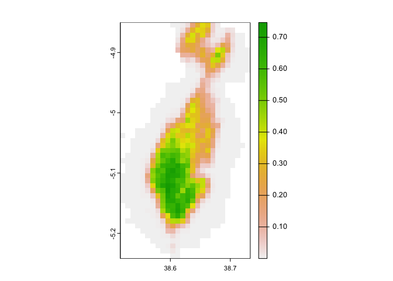
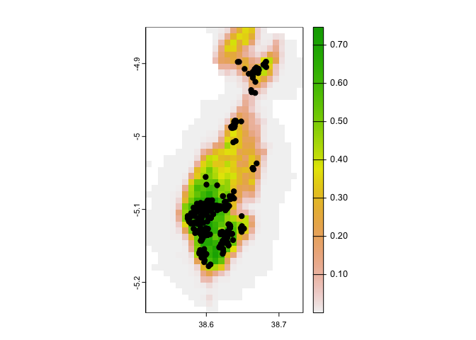
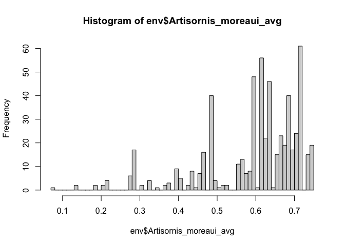

Threshold Artisornis
================
Dr. Jacob C. Cooper
2024-01-31

With thanks to Can Elverici and Marlon Cobos for technical assistance.

``` r
filepath <- "~/Dropbox/Manuscripts/Artisornis/"

library(tidyverse)
```

    ## ── Attaching core tidyverse packages ──────────────────────── tidyverse 2.0.0 ──
    ## ✔ dplyr     1.1.3     ✔ readr     2.1.4
    ## ✔ forcats   1.0.0     ✔ stringr   1.5.0
    ## ✔ ggplot2   3.4.4     ✔ tibble    3.2.1
    ## ✔ lubridate 1.9.3     ✔ tidyr     1.3.0
    ## ✔ purrr     1.0.2     
    ## ── Conflicts ────────────────────────────────────────── tidyverse_conflicts() ──
    ## ✖ dplyr::filter() masks stats::filter()
    ## ✖ dplyr::lag()    masks stats::lag()
    ## ℹ Use the conflicted package (<http://conflicted.r-lib.org/>) to force all conflicts to become errors

``` r
library(terra)
```

    ## terra 1.7.46
    ## 
    ## Attaching package: 'terra'
    ## 
    ## The following object is masked from 'package:tidyr':
    ## 
    ##     extract

``` r
final <- rast(paste0(filepath,
                     "kuenm_working/Final_Models/M_0.5_F_lq_Set2_NE/Artisornis_moreaui_avg.asc"))
plot(final)
```

<!-- -->

``` r
regional <- rast(paste0(filepath,
                     "kuenm_working/Final_Models/M_0.5_F_lq_Set2_NE/Artisornis_moreaui_current_conditions_expanded_area_avg.asc"))

plot(regional)
```

<!-- -->

``` r
points <- read_csv(paste0(filepath,"occ_joint.csv"))
```

    ## Rows: 589 Columns: 3
    ## ── Column specification ────────────────────────────────────────────────────────
    ## Delimiter: ","
    ## chr (1): ScientificName
    ## dbl (2): Longitude, Latitude
    ## 
    ## ℹ Use `spec()` to retrieve the full column specification for this data.
    ## ℹ Specify the column types or set `show_col_types = FALSE` to quiet this message.

``` r
plot(final)
points(points$Longitude,points$Latitude,pch=19)
```

<!-- -->

``` r
pts <- points%>%
  select(Longitude,Latitude)

env <- extract(x=final, y=pts)

hist(env$Artisornis_moreaui_avg,breaks=75)
```

<!-- -->

Data are heavily left skewed. We actually only have 78 unique
environmental localities, despite having hundreds of points.

We can threshold based on several different quantiles, focusing on the
unique environments.

``` r
uni.dat <- unique(dat)

# left tailed - suitability

thresh <- quantile(uni.dat,c(0.2,0.1,0.05,0.025))

final_thresh <- final
# five levels
final_thresh[final_thresh>=thresh[1]] <- 4
final_thresh[final_thresh>=thresh[2]&final_thresh<thresh[1]] <- 3
final_thresh[final_thresh>=thresh[3]&final_thresh<thresh[2]] <- 2
final_thresh[final_thresh>=thresh[4]&final_thresh<thresh[3]] <- 1
final_thresh[final_thresh<thresh[4]] <- 0

regional_thresh <- regional
regional_thresh[regional_thresh>=thresh[1]] <- 4
regional_thresh[regional_thresh>=thresh[2]&regional_thresh<thresh[1]] <- 3
regional_thresh[regional_thresh>=thresh[3]&regional_thresh<thresh[2]] <- 2
regional_thresh[regional_thresh>=thresh[4]&regional_thresh<thresh[3]] <- 1
regional_thresh[regional_thresh<thresh[4]] <- 0

plot(regional_thresh)
```

``` r
writeRaster(final_thresh,paste0(filepath,"final_threshold.asc"))
writeRaster(regional_thresh,paste0(filepath,"regional_threshold.asc"))
```
