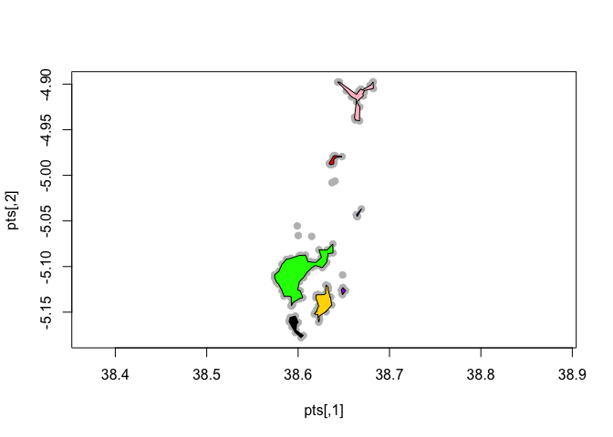
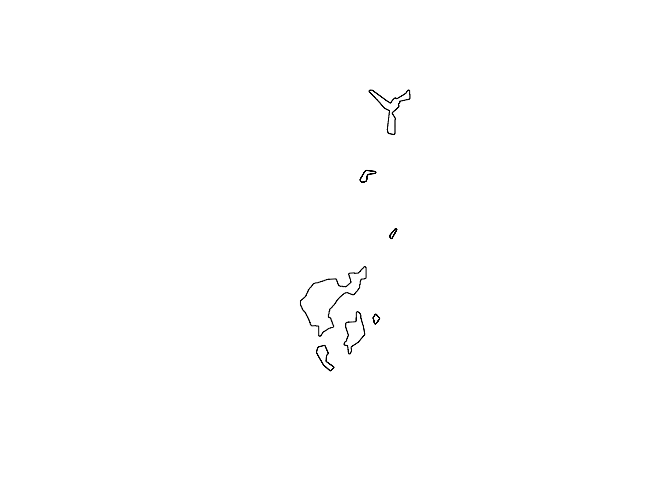
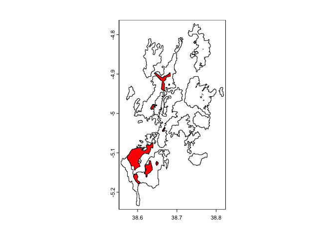
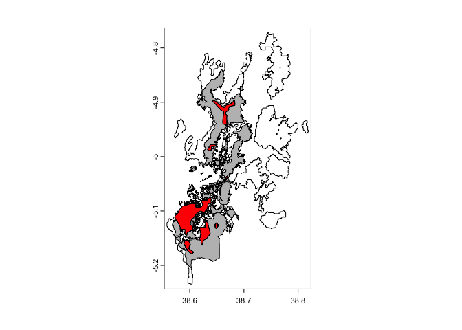
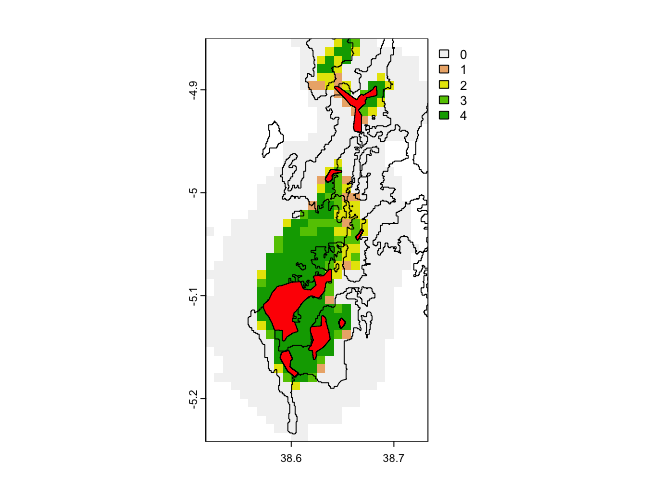
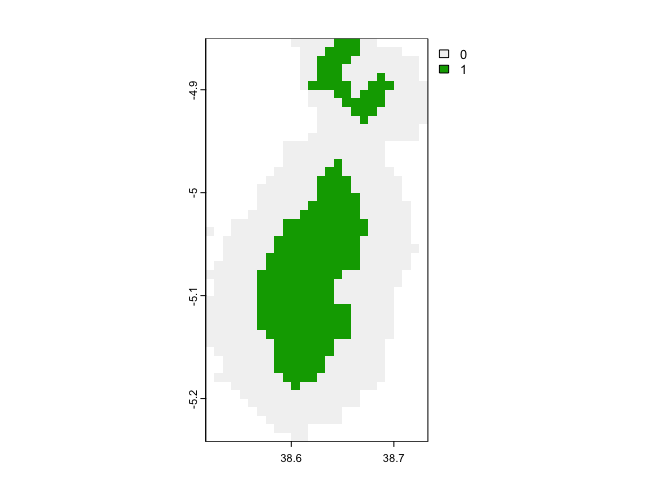
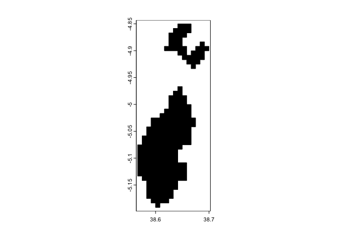
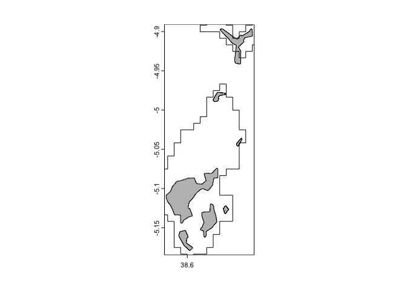
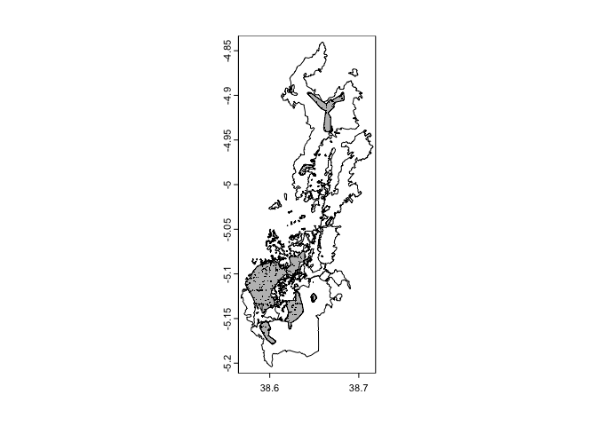

Range sizes
================
Jacob C. Cooper et al.
2024-01-31

The goal of this document is to compare ecological niche models and
survey data derived for *Artisornis moreaui* to forest cover and habitat
within the East Usambara Mountains.

``` r
library(data.table)
library(concaveman)
library(terra)
```

    ## terra 1.7.46

    ## 
    ## Attaching package: 'terra'

    ## The following object is masked from 'package:data.table':
    ## 
    ##     shift

``` r
library(sf)
```

    ## Linking to GEOS 3.11.0, GDAL 3.5.3, PROJ 9.1.0; sf_use_s2() is TRUE

``` r
library(tidyverse)
```

    ## ── Attaching core tidyverse packages ──────────────────────── tidyverse 2.0.0 ──
    ## ✔ dplyr     1.1.3     ✔ readr     2.1.4
    ## ✔ forcats   1.0.0     ✔ stringr   1.5.0
    ## ✔ ggplot2   3.4.4     ✔ tibble    3.2.1
    ## ✔ lubridate 1.9.3     ✔ tidyr     1.3.0
    ## ✔ purrr     1.0.2

    ## ── Conflicts ────────────────────────────────────────── tidyverse_conflicts() ──
    ## ✖ dplyr::between()     masks data.table::between()
    ## ✖ tidyr::extract()     masks terra::extract()
    ## ✖ dplyr::filter()      masks stats::filter()
    ## ✖ dplyr::first()       masks data.table::first()
    ## ✖ lubridate::hour()    masks data.table::hour()
    ## ✖ lubridate::isoweek() masks data.table::isoweek()
    ## ✖ dplyr::lag()         masks stats::lag()
    ## ✖ dplyr::last()        masks data.table::last()
    ## ✖ lubridate::mday()    masks data.table::mday()
    ## ✖ lubridate::minute()  masks data.table::minute()
    ## ✖ lubridate::month()   masks data.table::month()
    ## ✖ lubridate::quarter() masks data.table::quarter()
    ## ✖ lubridate::second()  masks data.table::second()
    ## ✖ purrr::transpose()   masks data.table::transpose()
    ## ✖ lubridate::wday()    masks data.table::wday()
    ## ✖ lubridate::week()    masks data.table::week()
    ## ✖ lubridate::yday()    masks data.table::yday()
    ## ✖ lubridate::year()    masks data.table::year()
    ## ℹ Use the conflicted package (<http://conflicted.r-lib.org/>) to force all conflicts to become errors

``` r
# read occurrence shapefile

occ <- read_sf("occ_joint.gpkg")
```

``` r
# create concave shapefiles around points
poly_pop <- function(shp,n){
  shp %>%
    filter(Population == n) %>%
    concaveman(concavity = 0.05,length_threshold = 0.01)
}

poly1 <- poly_pop(occ,1)
poly2 <- poly_pop(occ,2)
poly3 <- poly_pop(occ,3)
poly4 <- poly_pop(occ,4)
poly5 <- poly_pop(occ,5)
poly6 <- poly_pop(occ,6)
poly7 <- poly_pop(occ,7)

pts <- cbind(occ$Longitude,occ$Latitude)

plot(pts,pch=19,col="grey",asp=1)
plot(poly1,add=T,col="red")
plot(poly2,add=T,col="blue")
plot(poly3,add=T,col="green")
plot(poly4,add=T,col="black")
plot(poly5,add=T,col="gold")
plot(poly6,add=T,col="purple")
plot(poly7,add=T,col="pink")
```

<!-- -->

``` r
polyx <- rbind(poly1,poly2,poly3,
               poly4,poly5,poly6,poly7)

# many points ca. 130 m apart, so buffering to 100
# understory nonmigratory bird
# points pretty precise
buff_poly <- st_buffer(polyx,dist = 100)
plot(buff_poly)
```

<!-- -->

Here we have the buffered polygons around all the points that were
shown. We buffer to 100 m to reflect the general area, but keep it
restricted because these birds are territorial and non-migratory.

``` r
areas <- st_area(buff_poly)
# divide by 1,000,000 for sq km
areas_km <- areas/1000000

print(areas_km)
```

    ## Units: [m^2]
    ## [1]  0.9838935  0.3423286 21.1566015  2.3142708  5.4421805  0.4681184  5.5855381

These areas range between 21.2 km$^{2}$ for the largest area and less
than a square kilometer for some of the outlier groups. Keep in mind it
says “square meters”, but we are correcting for this by dividing by
1,000,000.

``` r
sum(areas_km)
```

    ## 36.29293 [m^2]

In total, the distribution of this species is approximately 36.3 km$^2$.

# Comparing to forest patches

Here, we have forest patches from the mountains.

``` r
# load forest patches
eam <- vect(paste0(filepath,"Eastern Arc Mountains/EAM_forest_patches_v9.shp"))

# load ecoregion area
eu <- which(eam$BLOCNAME=="East Usambara")
eu <- eam[eu]

# plot ecoregion and bird range
plot(eu)
plot(buff_poly,col = "red",add=T)
```

<!-- -->

# Comparing to landcover

``` r
landcover <- vect(paste0(filepath,"NewForestPolygonsUsambara.kml"))
```

    ## Warning: [vect] Z coordinates ignored

``` r
plots_and_fragments <- vect(paste0(filepath,"Plots&Fragments_15112019/Plots&Fragments_15112019.shp"))

plot(eu)
plot(landcover,col="grey",add=T)
plot(buff_poly,col = "red",add=T)
```

<!-- -->

``` r
# ecological niche model of Artisornis
# levels are 80%, 90%, 95%, 97.5%
arti_theory <- rast(paste0(filepath,"final_threshold.asc"))
```

``` r
plot(arti_theory)
plot(eu,add=T)
plot(buff_poly,add=T,col="red")
```

<!-- -->

## Differences between models

``` r
arti_theory2 <- arti_theory
arti_theory2[arti_theory2>0] <- 1
# binary map
plot(arti_theory2)
```

<!-- -->

``` r
# convert to shapefile
arti_theory_poly_all <- as.polygons(arti_theory2)
arti_theory_poly <- arti_theory_poly_all[2]
# range only
plot(arti_theory_poly,col="black")
```

<!-- -->

``` r
expanse(arti_theory_poly,unit="km")
```

    ## [1] 206.0783

``` r
sum(expanse(arti_theory_poly,unit="km"))
```

    ## [1] 206.0783

``` r
plot(vect(buff_poly),col="grey")
plot(arti_theory_poly,add=T)
```

<!-- -->

``` r
# create intersections
## theory intersections
arti_theory_buffer <- arti_theory_poly %>%
  terra::intersect(vect(buff_poly))

# remove self intersection error
landcover2 <- makeValid(landcover)

arti_theory_landcover <- arti_theory_poly %>%
  terra::intersect(landcover2)

arti_theory_eu <- arti_theory_poly %>%
  terra::intersect(eu)

arti_all_model <- arti_theory_poly %>%
  terra::intersect(eu) %>%
  terra::intersect(landcover2)

arti_all_info <- arti_theory_poly %>%
  terra::intersect(eu) %>%
  terra::intersect(landcover2) %>%
  terra::intersect(vect(buff_poly))

# looking at species distribution directly

buff_landcover <- vect(buff_poly) %>%
  terra::intersect(landcover2)

buff_eu <- vect(buff_poly) %>%
  terra::intersect(eu)
```

Let’s compare these maps.

``` r
plot(landcover2)
plot(buff_poly,add=T,col="grey")
plot(occ[1],add=T,col="black",pch=".")
```

<!-- -->

We can compare area of these different polygons as well.

First, for comparison:

``` r
print("Landcover Area")
```

    ## [1] "Landcover Area"

``` r
sum(expanse(landcover,unit="km"))
```

    ## [1] 190.138

``` r
min(expanse(landcover,unit="km"))
```

    ## [1] 0.004093615

``` r
max(expanse(landcover,unit="km"))
```

    ## [1] 60.57615

``` r
print("Ecoregion Area")
```

    ## [1] "Ecoregion Area"

``` r
sum(expanse(eu,unit="km"))
```

    ## [1] 384.343

``` r
min(expanse(eu,unit="km"))
```

    ## [1] 0.0100078

``` r
max(expanse(eu,unit="km"))
```

    ## [1] 121.4385

``` r
# arti theory and buffer
print("")
```

    ## [1] ""

``` r
print("Arti theory and Buffer")
```

    ## [1] "Arti theory and Buffer"

``` r
expanse(arti_theory_buffer,unit="km")
```

    ## [1]  2.3041742  5.4184320  0.4660753 21.0642505  0.3296004  0.9795936  4.2980883

``` r
sum(expanse(arti_theory_buffer,unit="km"))
```

    ## [1] 34.86021

``` r
# arti theory landcover
print("")
```

    ## [1] ""

``` r
print("Arti theory and Landcover")
```

    ## [1] "Arti theory and Landcover"

``` r
expanse(arti_theory_landcover,unit="km")
```

    ##   [1]  0.060443576  0.053616441  0.022420933  0.040327509  0.005698011
    ##   [6]  0.005890391  0.097434266  0.017473415  0.018508561  0.010372625
    ##  [11]  0.034208190  0.017726004  3.583221682  0.020437907  0.010046685
    ##  [16]  0.004093615  0.008839907  0.009056346  0.010233274  0.006297444
    ##  [21]  0.021796403  0.004434105  0.016898154  0.017583189  0.026256986
    ##  [26]  0.018160924  0.040581265 10.900140584  0.054069498  0.148252700
    ##  [31]  0.014495328  0.009718732  0.008575613  0.008989178  0.023158724
    ##  [36]  0.022702730  0.868624114  0.167846250  0.225496940  0.047551555
    ##  [41]  0.015508733  0.115838515  0.051426629  0.160010463  0.071393649
    ##  [46]  0.039672800  0.056916360  0.009605143  0.007569693  0.019532797
    ##  [51]  0.037508045  0.010208500  0.030685719  0.025597849  0.017122401
    ##  [56]  0.008534880  0.007766094  0.587800182  0.009163123  0.012344533
    ##  [61]  0.024901577  0.136144391  0.026763458  0.025391391  0.076913754
    ##  [66]  0.022685893  0.005599176  0.031750791  0.069205339  0.027963630
    ##  [71]  0.006082340  0.051330614  0.022006475  0.194911104  0.004903189
    ##  [76]  0.052375874  0.373003737  0.155389764 39.114077276  0.021197804
    ##  [81]  0.019695480  0.040124665  0.009015869  0.122037305  0.098302550
    ##  [86]  0.048102485  0.277869672  0.279914882  0.027252931  0.006575142
    ##  [91]  0.008416399  0.014703421  0.014160885  0.030927072  0.041331863
    ##  [96]  0.015926291  0.016889875  0.011024165  0.498166563  0.328682296
    ## [101]  3.329356638  0.004196671  0.008548251  1.168367961  0.190402915
    ## [106]  0.010199972  0.038473633  0.039199478  0.008403104  0.034086957
    ## [111]  0.011106134  0.017381828  2.451038438  0.012627455  0.119527795
    ## [116]  0.635727017  0.023512904  0.012502109  0.013242977  0.053326805
    ## [121]  0.027915824  0.023130345  0.013919663  0.156079543  0.017821545
    ## [126]  0.042400624  0.009430964  0.031075515  0.605787569  0.005301052
    ## [131]  1.532410912  0.012328489  0.033186140  0.018141965  0.006221631
    ## [136]  0.008473821  4.665046135  0.067996875  0.002912467  0.006849409
    ## [141]  0.028658660 34.882142714

``` r
sum(expanse(arti_theory_landcover,unit="km"))
```

    ## [1] 110.7061

``` r
#arti_theory_eu
print("")
```

    ## [1] ""

``` r
print("Arti theory and Ecoregion")
```

    ## [1] "Arti theory and Ecoregion"

``` r
expanse(arti_theory_eu,unit="km")
```

    ## [1] 53.5260746  0.2501905  0.3702790  0.2158435 40.9337549 13.0204321

``` r
sum(expanse(arti_theory_eu,unit="km"))
```

    ## [1] 108.3166

``` r
# arti_all_models
print("")
```

    ## [1] ""

``` r
print("All models and landcover combined")
```

    ## [1] "All models and landcover combined"

``` r
expanse(arti_all_model,unit="km")
```

    ##  [1] 4.339317e-02 8.106086e-03 5.890391e-03 1.850856e-02 2.296265e-02
    ##  [6] 1.772600e-02 2.637049e-01 1.758843e-03 6.297444e-03 1.758319e-02
    ## [11] 2.005475e-02 7.221800e+00 1.971001e-03 1.316374e-01 1.449533e-02
    ## [16] 9.718732e-03 8.522578e-03 1.008455e-03 2.315872e-02 5.864718e-01
    ## [21] 8.688817e-02 1.882997e-02 4.724447e-02 1.550873e-02 9.908210e-02
    ## [26] 2.940067e-02 9.738695e-03 2.919187e-02 7.223856e-03 1.640363e-02
    ## [31] 3.552442e+01 2.119780e-02 1.969548e-02 5.506397e-04 1.534204e-02
    ## [36] 1.441574e-02 8.416399e-03 2.448778e-02 4.342336e-03 1.769017e-02
    ## [41] 2.873374e-02 6.853513e-03 5.868196e-04 1.105551e-02 2.006310e-02
    ## [46] 2.190279e-01 4.030057e-03 9.314761e-02 2.389034e-02 3.329357e+00
    ## [51] 2.054065e-03 4.358106e-01 1.861107e-01 1.447658e+00 1.262745e-02
    ## [56] 9.384093e-02 4.913457e-01 2.196234e-02 1.250211e-02 7.129573e-03
    ## [61] 4.791285e-02 1.966217e-05 4.240062e-02 9.430964e-03 3.107551e-02
    ## [66] 3.281206e-01 5.301052e-03 9.217543e-01 2.165917e-04 3.295160e-02
    ## [71] 7.473641e-03 6.221631e-03 3.386644e+00 1.895953e+01 1.033180e+01

``` r
sum(expanse(arti_all_model,unit="km"))
```

    ## [1] 84.99349

``` r
# arti_all_info
print("")
```

    ## [1] ""

``` r
print("All presented info")
```

    ## [1] "All presented info"

``` r
expanse(arti_all_info,unit="km")
```

    ##  [1] 0.0081060856 0.0058903914 0.0126168583 0.0798068591 0.0017588428
    ##  [6] 0.0062623805 0.0013066461 6.1523723617 0.0001163740 0.1228379897
    ## [11] 0.0144953280 0.0097187316 0.0062849310 0.0010084546 0.0231587237
    ## [16] 0.5864718409 0.0868881733 0.0188299713 0.0472444708 0.0155087330
    ## [21] 0.0990821044 0.0270313454 0.0143035526 2.0842671450 4.7351652045
    ## [26] 0.4660753395 3.3583684792 0.0084163993 0.0244877762 0.0006163782
    ## [31] 0.1739837481 0.3119428266 4.0383759675

``` r
sum(expanse(arti_all_info,unit="km"))
```

    ## [1] 22.5428

``` r
# buff + landcover
print("")
```

    ## [1] ""

``` r
print("Buffer + Landcover")
```

    ## [1] "Buffer + Landcover"

``` r
expanse(buff_landcover,unit="km")
```

    ##  [1] 0.8654744104 0.3236762867 1.4370279101 0.0100466855 0.0040936148
    ##  [6] 0.0088399068 0.0090563460 0.0102332741 0.0062623805 0.0013066461
    ## [11] 7.1074780900 0.0022575167 0.1394532502 0.0144953280 0.0097187316
    ## [16] 0.0063379656 0.0089891782 0.0231587237 0.8686241138 0.1678462499
    ## [21] 0.1729930767 0.0475515552 0.0155087330 0.1158385146 0.0490573059
    ## [26] 0.0253893522 0.0143674373 4.4146584155 0.0065751422 0.0084163993
    ## [31] 0.0115218129 0.0413318634 0.0159262909 0.0004342527 0.0006326806
    ## [36] 0.0330335199 0.0049021746 0.0340869568 0.0478810318 0.0126181682
    ## [41] 2.0851668988 0.0125263552 0.0058903914 4.7351652045 0.4660753395
    ## [46] 5.5567814120

``` r
sum(expanse(buff_landcover,unit="km"))
```

    ## [1] 28.95871

``` r
# buff + eu
print("")
```

    ## [1] ""

``` r
print("Buffer and Ecoregion")
```

    ## [1] "Buffer and Ecoregion"

``` r
expanse(buff_eu,unit="km")
```

    ## [1]  0.3119428  0.2003186 12.8753898  2.3032720  5.3696243  0.4660753  5.2696378

``` r
sum(expanse(buff_eu,unit="km"))
```

    ## [1] 26.79626

``` r
# buff removing all
# arti_all_info
buff_poly2 <- makeValid(vect(buff_poly))
remaining <- buff_poly2 %>%
  erase(eu) %>%
  erase(landcover2) %>%
  erase(arti_theory_poly)

expanse(remaining,unit="km")
```

    ## [1] 0.0002297197

``` r
sum(expanse(remaining,unit="km"))
```

    ## [1] 0.0002297197
